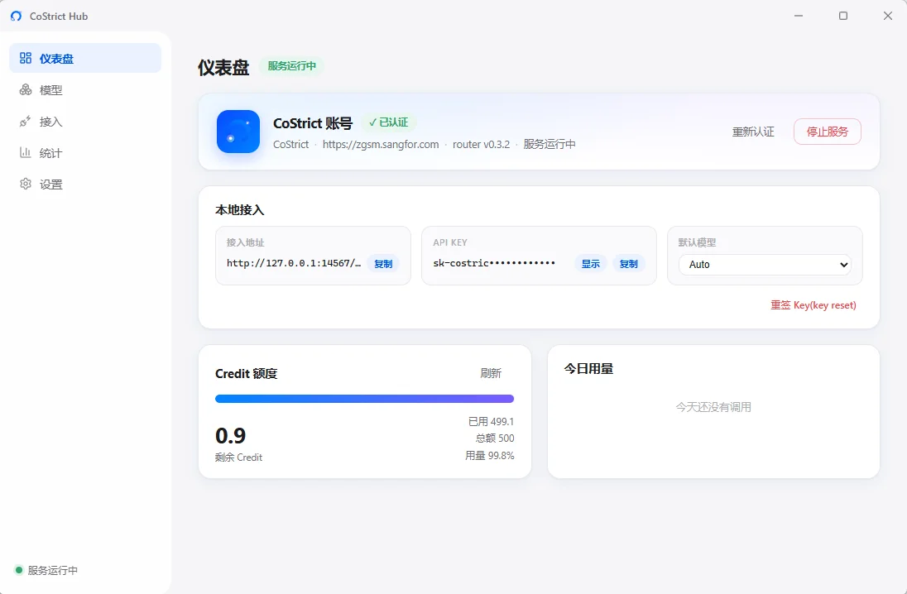
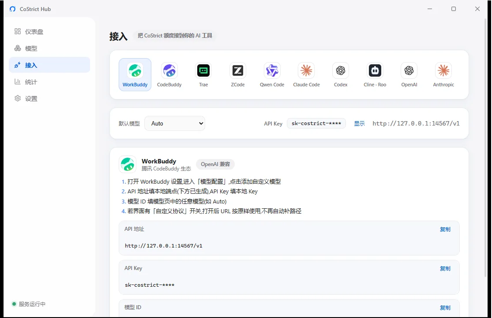
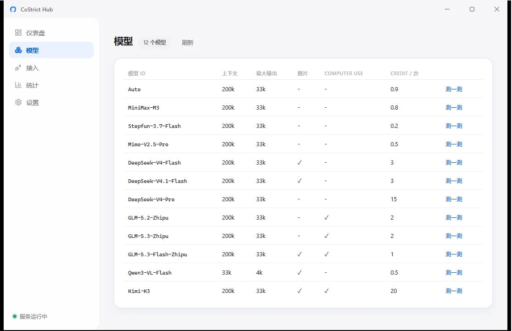
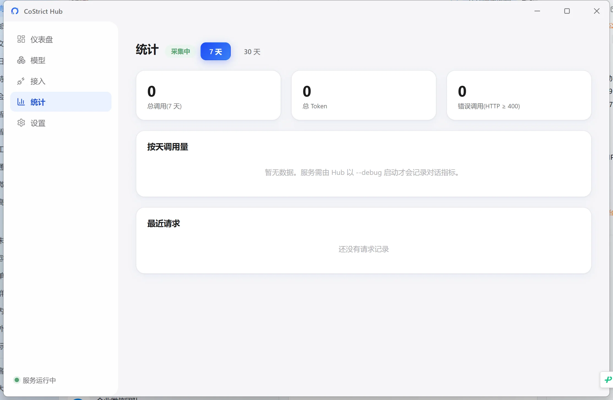

# CoStrict Hub

**CoStrict 额度代理中枢** —— 把 CoStrict(深信服 AI 编码平台)账号的 Credit 额度,通过本地 OpenAI / Anthropic 兼容接口代理给任意 AI 工具使用:Claude Code、Codex、Trae、WorkBuddy、CodeBuddy、ZCode、Qwen Code、Cline / Roo Code……

Tauri 2 桌面应用(Rust 核心 + React/TS 前端),Windows 优先,常驻托盘。

## 下载

从 [Releases](https://github.com/Ryan-99/costrict-hub/releases/latest) 下载安装(内置 costrict-router,安装即用,自带 sha256 校验):

- **Windows 10/11 x64**:`CoStrict.Hub_x.x.x_x64-setup.exe`
- **macOS 12+**(Apple Silicon / Intel 通用):`CoStrict.Hub_x.x.x_universal.dmg`

> macOS 首次使用时,Hub 会自动从 GitHub Releases 下载对应平台的 costrict-router(带 sha256 校验)。

## 它是怎么工作的

```
AI 工具(任意 OpenAI / Anthropic 兼容客户端)
        │  http://127.0.0.1:14567/v1  (Bearer sk-costrict-…)
        ▼
costrict-router(第三方 Go 二进制,Hub 托管)
        │  协议转换 + 上游 token 自动刷新
        ▼
CoStrict 云端(https://zgsm.sangfor.com,支持企业内网地址)
```

Hub 负责编排:一键 SSO 认证、服务启停与自愈、本地 API Key 管理、额度看板、模型列表、用量统计、接入配置生成。上游 token 由 costrict-router 自己管理(Hub 不接触),与 pi-gui 等其他工具共享同一份登录态。

## 界面

**仪表盘** — 认证状态、服务启停、三要素直达复制、Credit 额度一目了然：



**接入** — 点击工具 logo,配置片段自动代入端点 / Key / 模型，一键复制：



**模型** — 全部可用模型与单次 Credit 消耗：



**统计** — 按天调用量与请求明细：



## 功能

- **仪表盘**:认证状态 + 重新认证弹窗、服务启停/重启、接入地址 / API Key / 默认模型三要素直达复制、Credit 额度进度条(15s 自动刷新)、当日用量
- **模型**:上游模型列表 + 每模型单次 Credit 消耗 + 连通自检(真实发送一条消息)
- **接入**:10+ 工具官方 logo 一行选择,点击查看分步配置,片段已代入端点 / Key / 默认模型一键复制;Codex 支持 router 自带 `codex-catalog` 自动写入
- **统计**:按天调用量 / Token / 错误数,最近请求明细(来自 router `--debug` 日志)
- **设置**:服务地址(支持企业内网)、端口、开机自启、自愈拉起、退出停服、二进制下载与校验
- **常驻**:托盘最小化、关窗不退出、开机自启、单实例

## 使用前提

- CoStrict 账号(SSO 登录)
- Windows 10/11 x64 或 macOS 12+

## 构建

```bash
pnpm install
pnpm tauri dev     # 开发
pnpm tauri build   # NSIS 安装包 → src-tauri/target/release/bundle/nsis/
```

要求:Node 20+、pnpm、Rust stable(`x86_64-pc-windows-msvc`)。

## 安全与供应链

- 二进制下载内置 sha256 pin 表(v0.3.2 全平台资产),未 pin 的新版本走 TOFU(首次记录、事后变更即拒绝)
- 随包分发的二进制复制前做哈希校验
- 登录链接 / 服务地址只信任 `*.sangfor.com` 与本机回环,防钓鱼重定向
- 本地 API Key 存系统凭据管理器(keyring),降级才落文件;上游 token 由 router 自管,Hub 不落盘

## 相关项目

- [mokeyjay/costrict-router](https://github.com/mokeyjay/costrict-router) — 本地代理核心(Go)
- [zgsm-ai/costrict](https://github.com/zgsm-ai/costrict) — CoStrict 官方开源

## License

MIT
